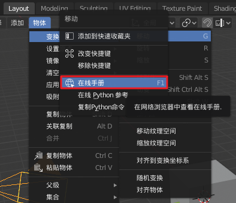
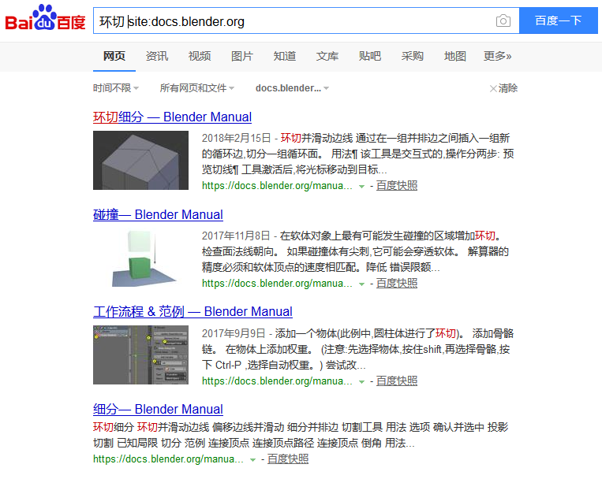
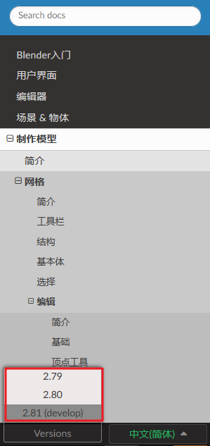
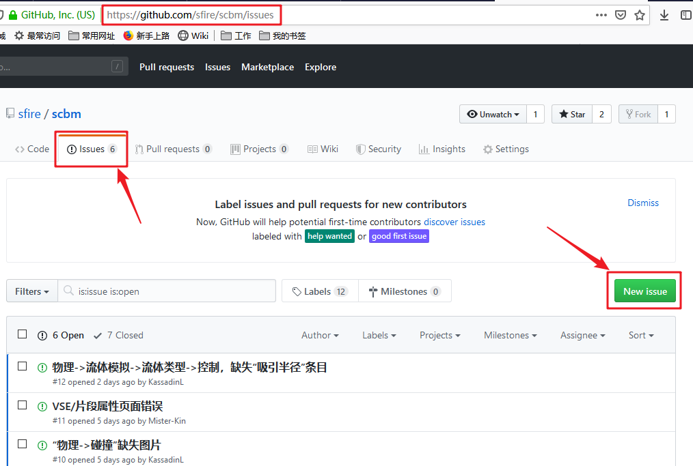

# Blender 用户手册的使用姿势

## 查询方法

### 1. 从用户界面打开

Blender中的多数操作和设置都是与对应的手册页面绑定的，在使用时遇到疑问时可直接从界面跳转对应页面查询手册。

方法1：在操作菜单等界面元素上单击右键，并在右键菜单选择  **在线手册**；

方法2：在操作菜单等界面元素上按下 `F1`，也可以打开对应的手册页面。

### 2. 搜索引擎查询

用过Blender手册自带的搜索功能的用户应该体会过 **感人的查询速度** 和 **并不满意的结果**。

所以，如果需要以关键字查询手册的话，还是建议使用 **搜索引擎**。搜索的方法就是 **关键字** + `site:docs.blender.org`。下图以百度查询环切举例：

## 版本区分

Blender 2.8从开发测试阶段就注定会带来巨大的界面与功能变化，所以从Blender 2.8基本定型之后，Blender 2.79版本的用户手册就被冻结。而2.80版本正式发布后，Blender 2.8的用户手册也被冻结。所以，官方其实提供了三个版本的用户手册供用户选择：

三个版本的中文手册的区别如下：

- **2.79**: 对应Blender 2.79版本，翻译进度 **80%** 左右，不再维护；

- **2.80**: 对应Blender 2.79版本，翻译进度 **70%** 左右，不再维护；

- **2.81(develop)**: 对应最新状态的每日版，翻译进度95%左右，官方文档组持续维护原文，BlenderCN手册翻译组翻译中，并持续维护译文。

每日版目前都是在为2.80版添加功能，所以开发版的手册其实大体上是可以当作2.80版来用的。我们推荐2.80版本的用户使用 **2.81(develop)** 开发版的用户手册。

## 参与与反馈

经过一个多月的努力，手册翻译组组织了对2.8x版本的手册的全面翻译工作，目前翻译进度95%。

由于时间仓促及英语水平限制，中文手册存在较多的错误，可读性也不是那么理想。我们寄希望于全社区一起参与中文手册的完善工作，为后来者造福。

- 有意愿参与翻译及校对的，可加翻译组QQ群号：620831153

- 手册使用过程中发现译文问题，或者有改进建议的，可至 [GitHub](https://github.com/sfire/scbm/) 反馈，我们会统一处理。

